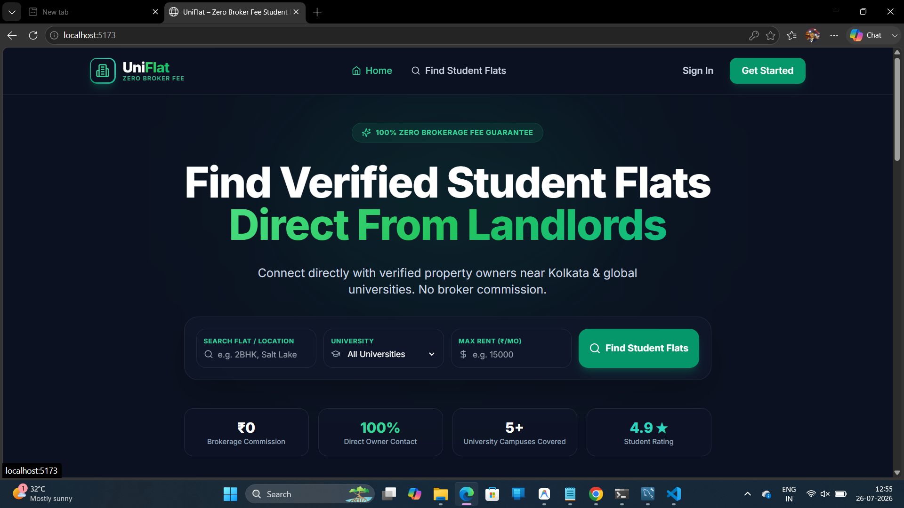
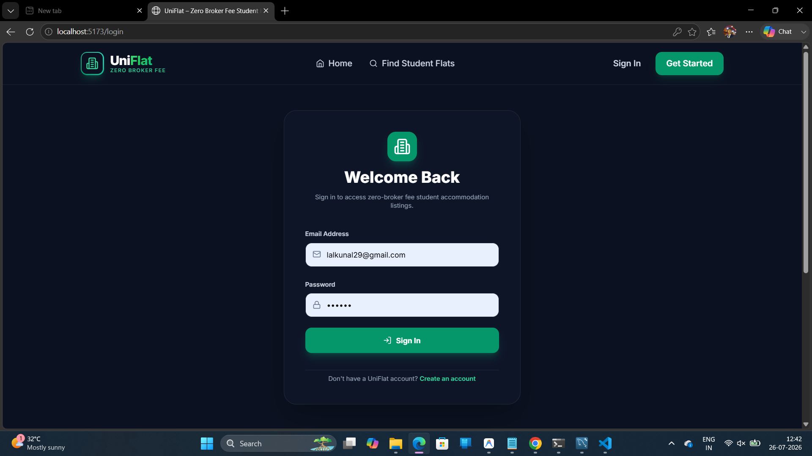
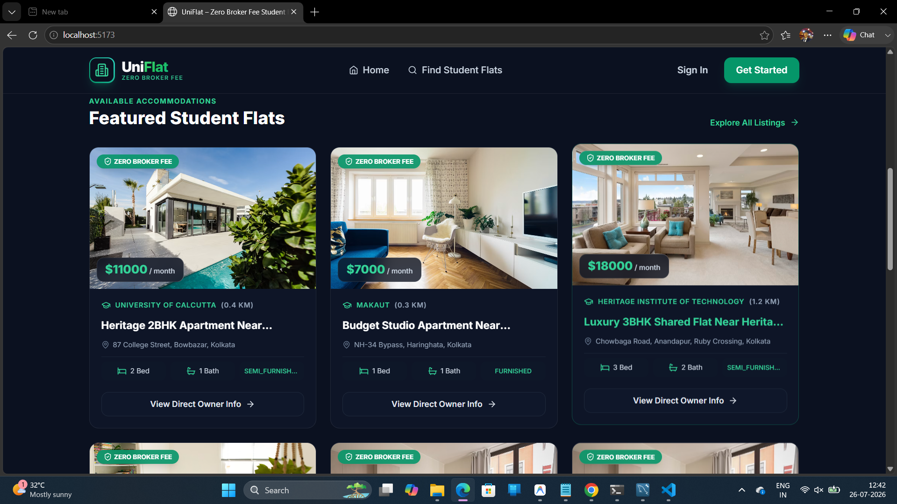
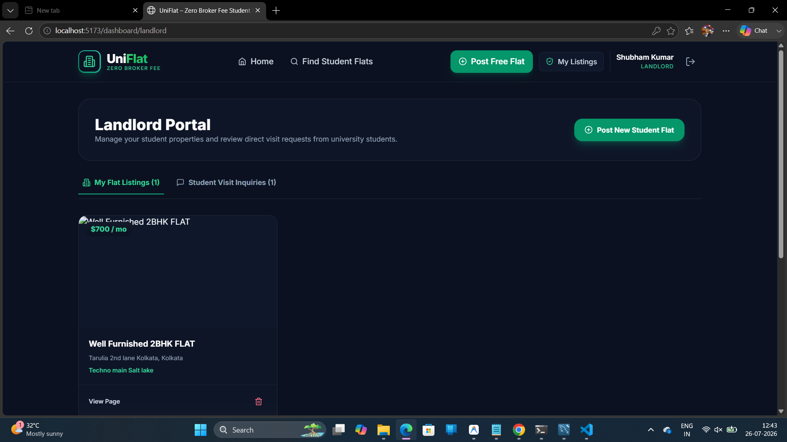
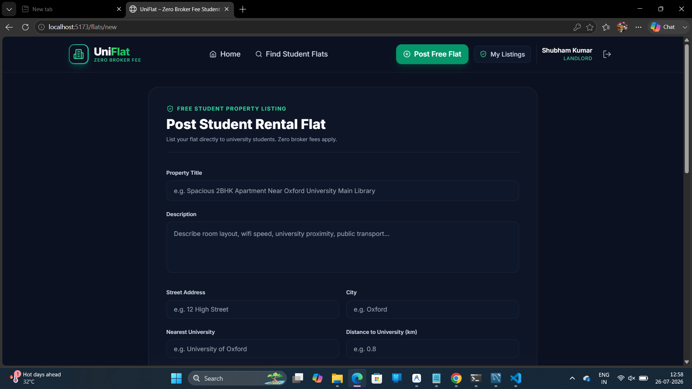
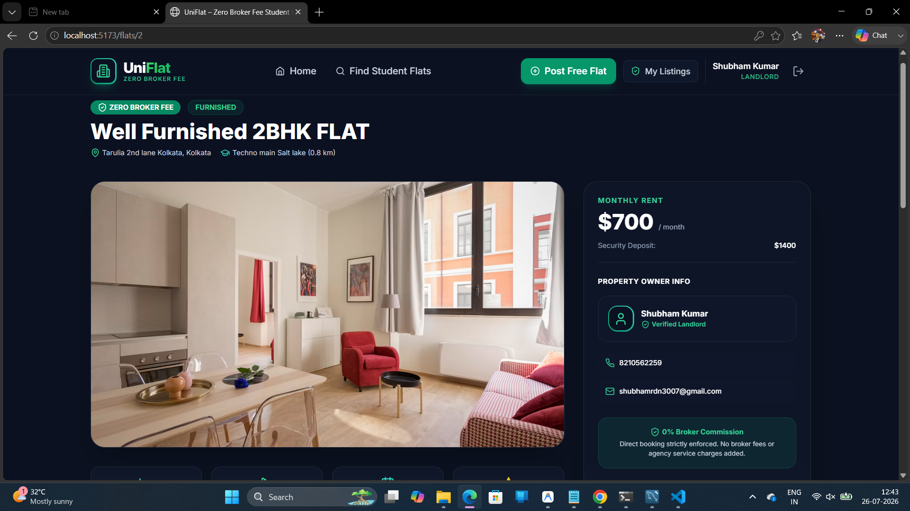
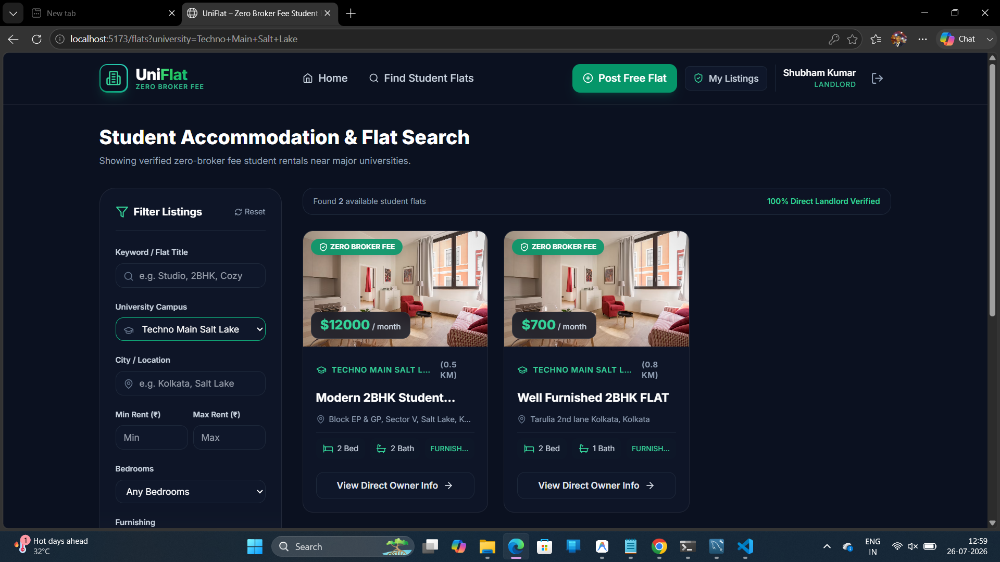

# 🏠 UniFlat – Zero Broker Fee Student Rental Platform

> A full-stack web application that enables students to find rental flats directly from property owners without paying brokerage fees.

---

## 🚀 Overview

UniFlat is a role-based rental platform developed using **Spring Boot** and **React.js**. Students can search and inquire about flats, while landlords can manage their property listings through a secure dashboard.

---

## ✨ Features

### 👨‍🎓 Student

- 🔐 Register & Login
- 🏠 Browse Available Flats
- 🔍 Search Flats
- ❤️ Save Favorite Flats
- 📩 Send Inquiry to Owner
- 👤 Manage Profile

### 🏡 Landlord

- 🔐 Secure Login
- ➕ Add New Flats
- ✏️ Edit Flat Details
- 🗑 Delete Flats
- 📋 Manage Listings
- 📬 View Student Inquiries

### 🔒 Security

- JWT Authentication
- Spring Security
- BCrypt Password Encryption
- Role-Based Authorization

---

# 🛠 Tech Stack

| Category | Technology |
|----------|------------|
| Frontend | React.js, Vite, Tailwind CSS |
| Backend | Spring Boot, Spring Security |
| Database | MySQL |
| ORM | Hibernate, Spring Data JPA |
| Authentication | JWT |
| Build Tool | Maven |
| Version Control | Git & GitHub |
| API Testing | Postman |

---

# 📸 Application Screenshots

## 🏠 Home Page



---

## 🔑 Login Page




---


## 📝 Dasboard



---

## 🎓 Student Dashboard


---

## 🏡 Landlord Dashboard



---

## ➕ Add Flat



---

## 📄 Flat Details



---

## 🔍 Search Flats




---


# 📂 Project Structure

```text
UniFlat
│
├── backend
├── frontend
├── README.md
├── .gitignore
├── home.png
├── login.png
├── register.png
├── student-dashboard.png
├── owner-dashboard.png
├── add-flat.png
├── flat-details.png
├── search.png
├── favorites.png
└── inquiry.png
```

---

# ⚙ Installation

## Clone Repository

```bash
git clone https://github.com/YOUR_GITHUB_USERNAME/UniFlat.git
```

## Backend

```bash
cd backend
./mvnw spring-boot:run
```

## Frontend

```bash
cd frontend
npm install
npm run dev
```

---

# 🗄 Database Configuration

Create a MySQL database:

```sql
CREATE DATABASE uniflat;
```

Update `application.yml` with your MySQL username and password.

Example:

```yaml
spring:
  datasource:
    url: jdbc:mysql://localhost:3306/uniflat
    username: root
    password: YOUR_PASSWORD
```

---

# 🌐 Application URLs

Frontend:

```
http://localhost:5173
```

Backend:

```
http://localhost:8080
```

---

# 🔮 Future Enhancements

- 📧 Email Notifications
- ☁️ Cloudinary Image Upload
- 🗺 Google Maps Integration
- 💬 Real-time Chat
- 💳 Online Rent Payment
- 📱 Mobile Application

---

# 👨‍💻 Author

**Shubham Kumar**

Java Full Stack Developer

- GitHub: https://github.com/Shubham2259
- LinkedIn: https://www.linkedin.com/in/shubham-kumar-3b1110290

---

## ⭐ Support

If you like this project, please consider giving it a **⭐ Star** on GitHub.
